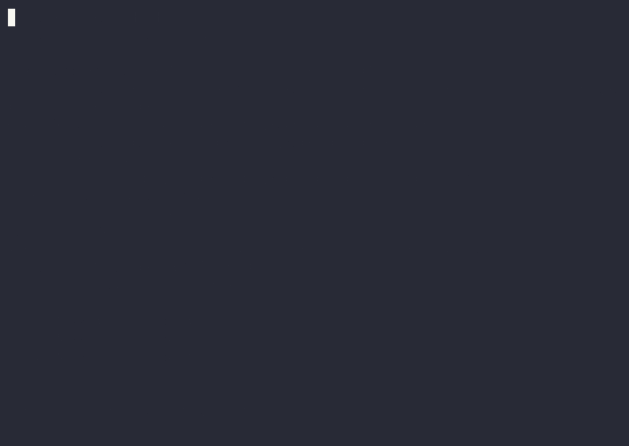

> ▶ Interactive version: https://asciinema.org/a/nv6BvyrscFO6s7kv  ·  replay locally: asciinema play demo/agent-bisect-demo.cast

# agent-bisect

`agent-bisect` is git-bisect for agent runs: it deterministically localizes the first visible breaking step, and refuses to guess when it cannot see one.

Demo: read the recorded transcript at [demo/DEMO-TRANSCRIPT.md](demo/DEMO-TRANSCRIPT.md), or run it yourself with `agent-bisect demo`.

| win | result | source |
| --- | ---: | --- |
| exact-step localization on controlled visible breaks | 1085/1151 (94.3%) | [ACCURACY.md](ACCURACY.md) |
| HIGH-confidence exact-step localization | 1083/1083 (100%) | [ACCURACY.md](ACCURACY.md) |
| false positives on controlled negative probes | 0/1061 | [ACCURACY.md](ACCURACY.md) |
| adapter surfaces | 4: Claude, Codex, foreign trajectories, Who&When boundary mapping | CLI + [BENCHMARK.md](BENCHMARK.md) |
| replay discipline | deterministic-invariant suite + CI | [INVARIANTS.md](INVARIANTS.md) + tests |

The corpus finding comes second: across 6,735 real runs, only 113 expose a deterministic gate-visible break (about 1.7% engage / 98.3% abstain). That is a visibility result, not a defect: most real transcripts do not expose a deterministic G1/G2/G3 break for this tool to localize. The `0/181` Who&When result is the same boundary in a semantic attribution setting: the right answer is to abstain rather than invent evidence.

Class-mix caveat up front: the 94.3% headline is G1-weighted. Per class, the controlled exact-step result is G1 93.4%, G2 100%, G3 100%; G2/G3 are perfect but small-n.

## Honest Result

The project is measured as a triad: coverage on real transcripts, accuracy on the gate-visible slice, and a semantic boundary benchmark.

| question | measured result | caveat |
| --- | ---: | --- |
| How often do real runs expose a deterministic break? | 113/6735 runs, about 1.7% | From `STUDY.md`; this is a visibility slice, not a failure-rate claim. |
| When a controlled break is visible, how precisely is it localized? | 1085/1151 exact (94.3%); HIGH 1083/1083 (100%) | From `ACCURACY.md`; G1-weighted average: 1000/1151 target injections are G1 schema faults. |
| Does it false-alarm on controlled negatives? | 0 FP on 1061 CONTROL/BENIGN probes | From `ACCURACY.md`; negatives are controlled injected probes. |
| What happens outside the deterministic envelope? | Who&When exact 0/181; coverage gaps 181/181 | From `BENCHMARK.md`; semantic multi-agent attribution is out of scope, so the tool abstains rather than guesses. |

The short version: `agent-bisect` is precision-first on the slice it can inspect, and deliberately explicit about the much larger slice it cannot.

## 60-Second Quickstart

```powershell
pip install -e .
agent-bisect demo
```

Manual commands:

```powershell
agent-bisect ingest tests/fixtures/claude_sanitized.jsonl --out demo.journal.jsonl
agent-bisect localize demo.journal.jsonl
agent-bisect replay demo.journal.jsonl --explain
```

Expected output:

```text
wrote 6 activities to demo.journal.jsonl
status	no_break
agent-bisect replay --explain
run_id: claude_sanitized
activities: 6
kinds: file_edit=1 llm_call=1 opaque_shell=1 test_run=1 tool_call=1 user_msg=1
structured_fraction: 3/6 (0.500)
shell_target_coverage: steps_with_targets=0/2 added_edges=0
gate_tallies:
  G1: PASS=3 FAIL=0 NA=3
  G2: PASS=0 FAIL=0 NA=6
  G3: PASS=1 FAIL=0 NA=5
verdict: clean run
```

For the caught-failure walkthrough, see [demo/WALKTHROUGH.md](demo/WALKTHROUGH.md).

## Command Surface

- `ingest`: convert a Claude transcript into a normalized journal.
- `ingest-codex`: convert a Codex transcript into a normalized journal.
- `ingest-foreign`: convert SWE-agent, mini-swe-agent, or OpenHands fixtures.
- `demo`: run the packaged replayable demo: HIGH-confidence localization first, clean-control abstention second.
- `show`: print a structural timeline, optionally with gate verdicts.
- `localize`: report deterministic gate failures and their first visible breaking step.
- `replay`: render the structural explain view.
- `eval`: run the small injected-fault evaluation.
- `scan`: scan transcripts or journals for gate failures.
- `sweep-foreign`: measure foreign trajectory adapter coverage.
- `coverage-codex`: summarize Codex transcript ingest coverage.
- `fetch-swe-agent-trajectories`: fetch public SWE-agent trajectory samples into ignored local data.
- `fetch-openhands-realtask-trajectories`: fetch public OpenHands trajectory samples into ignored local data.
- `benchmark-who-when`: score the public Who&When boundary benchmark.
- `corpus-study`: produce aggregate-only real-corpus coverage rates.
- `accuracy`: run the controlled localization-accuracy campaign.

## What It Deliberately Does Not Do

- It is not a durable-execution runtime, scheduler, or state system.
- It is not memory or long-term context storage.
- It does not replay the model, infer hidden intent, or reconstruct work missing from the transcript.
- It does not treat opaque shell text as structured evidence unless a conservative file-target link is recoverable.
- It abstains outside the deterministic envelope instead of turning semantic ambiguity into a false-precise answer.

## How To Read The Project

- [STUDY.md](STUDY.md): aggregate-only coverage study over real transcripts plus shipped fixtures.
- [ACCURACY.md](ACCURACY.md): controlled injected-fault localization accuracy with visible denominators and class mix.
- [BENCHMARK.md](BENCHMARK.md): Who&When semantic-boundary result.
- [DESIGN.md](DESIGN.md): deterministic-envelope rationale, gates, localization, and evaluation design.

## Install And Test

```powershell
pip install -e .[dev]
pytest -q
```

Runtime code uses only the Python standard library. The development extra installs pytest for tests.
